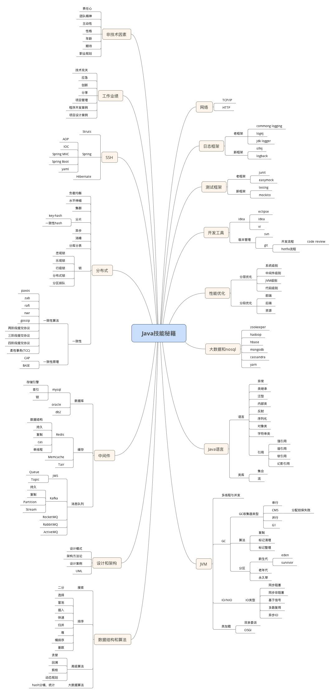
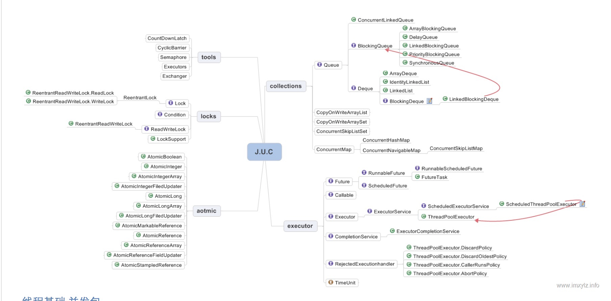
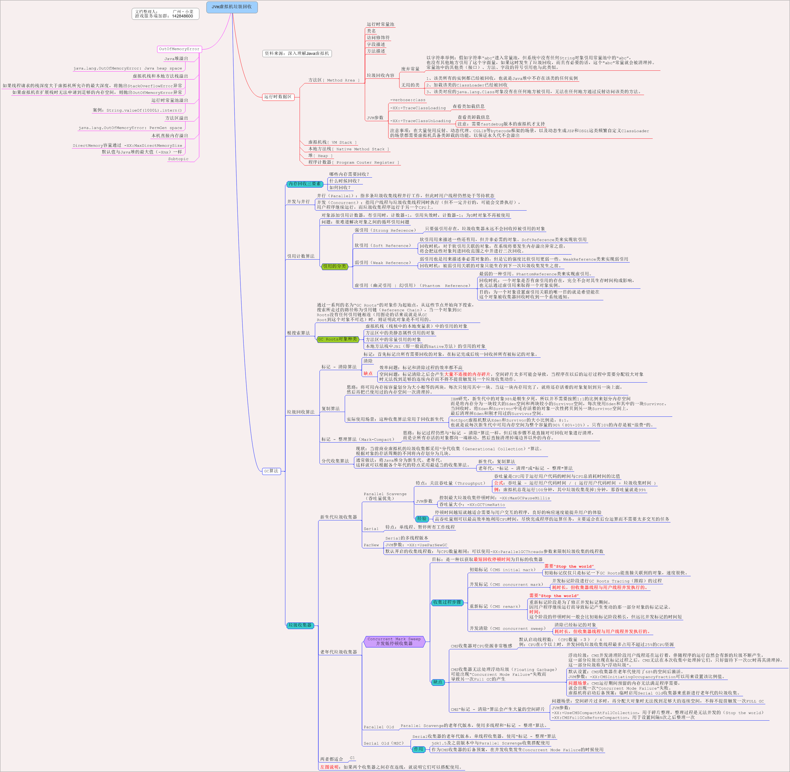
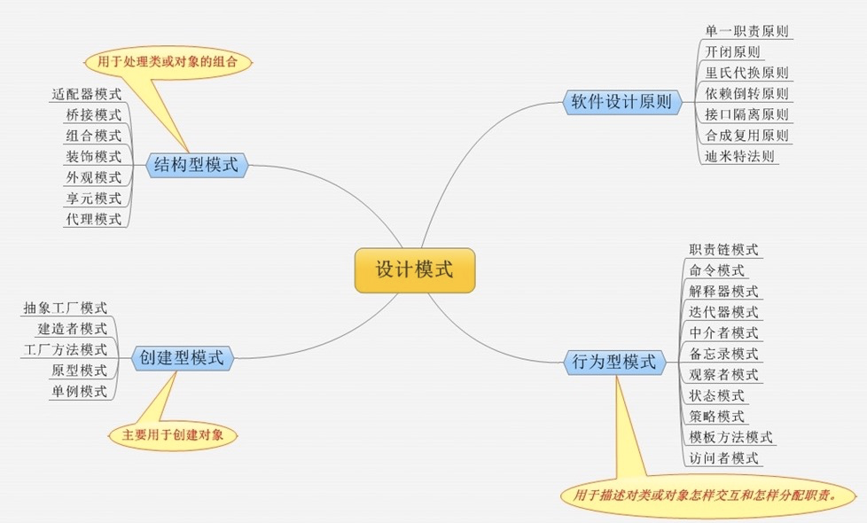

<h1> Java技术体系知识 </h1>

* [Java集合](https://github.com/xiaofang168/java-backend-graph/blob/master/Java.md#Java集合)

* [Java技能](https://github.com/xiaofang168/java-backend-graph/blob/master/Java.md#Java技能)

* [Java并发](https://github.com/xiaofang168/java-backend-graph/blob/master/Java.md#Java并发)

* [Java虚拟机](https://github.com/xiaofang168/java-backend-graph/blob/master/Java.md#Java虚拟机)

* [设计模式](https://github.com/xiaofang168/java-backend-graph/blob/master/Java.md#设计模式)

## Java集合

## Java技能

## Java并发

## Java虚拟机

## 设计模式

