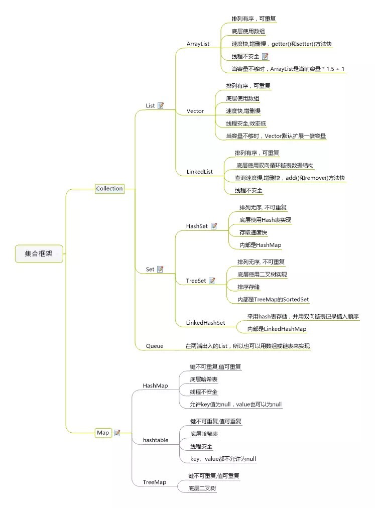

<h1> Java技术体系知识 </h1>

* [Java集合](http://git.etouch.cn/gitbucket/BTC/backend-architect-learning-guide/java.md#Java集合)

* [Java技能](http://git.etouch.cn/gitbucket/BTC/backend-architect-learning-guide/java.md#Java技能)

* [Java并发](http://git.etouch.cn/gitbucket/BTC/backend-architect-learning-guide/java.md#Java并发)

* [Java虚拟机](http://git.etouch.cn/gitbucket/BTC/backend-architect-learning-guide/java.md#Java虚拟机)

* [设计模式](http://git.etouch.cn/gitbucket/BTC/backend-architect-learning-guide/java.md#设计模式)

## Java集合

## Java技能

## Java并发

## Java虚拟机

## 设计模式

